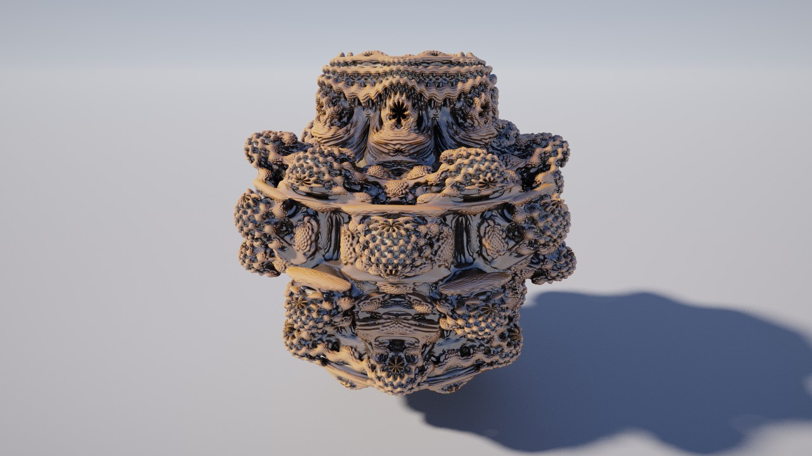
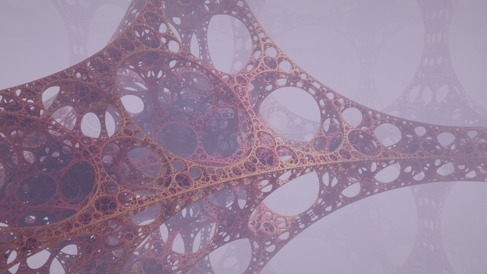
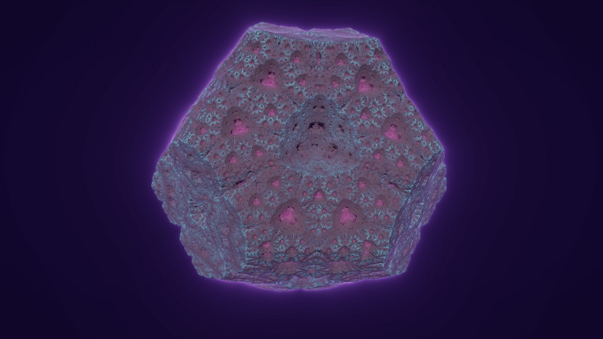
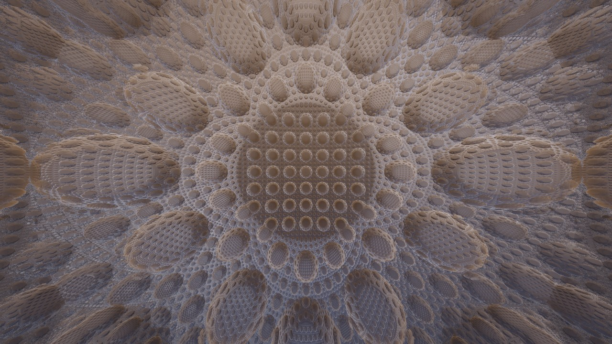
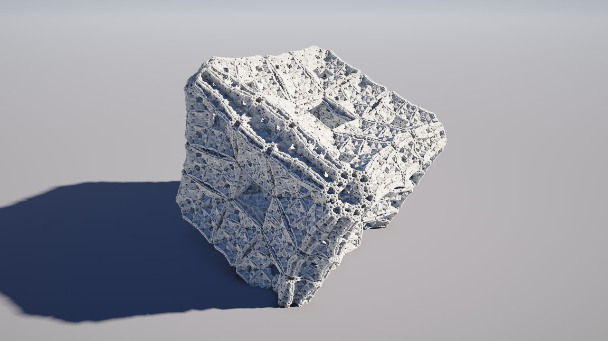
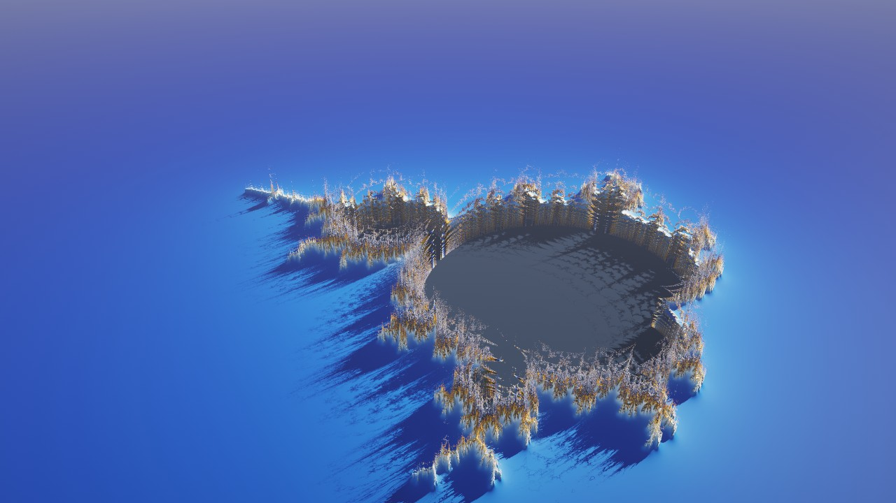
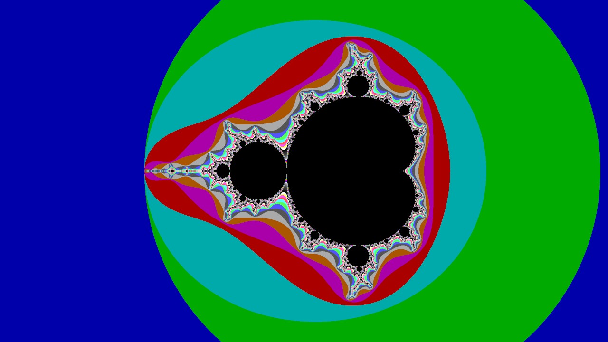
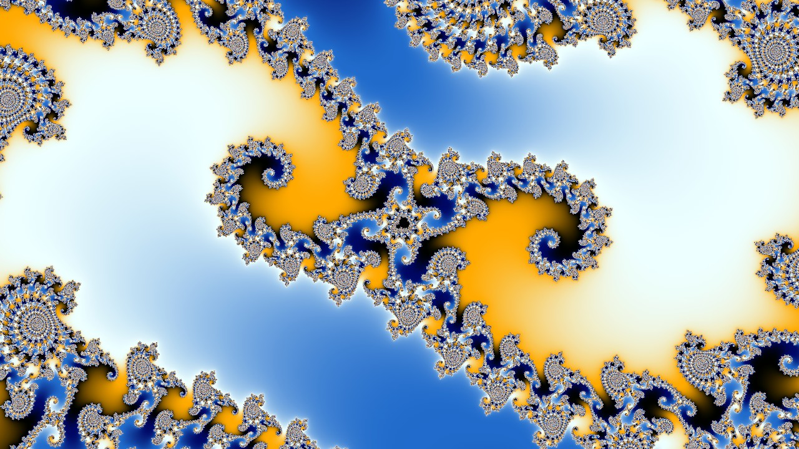
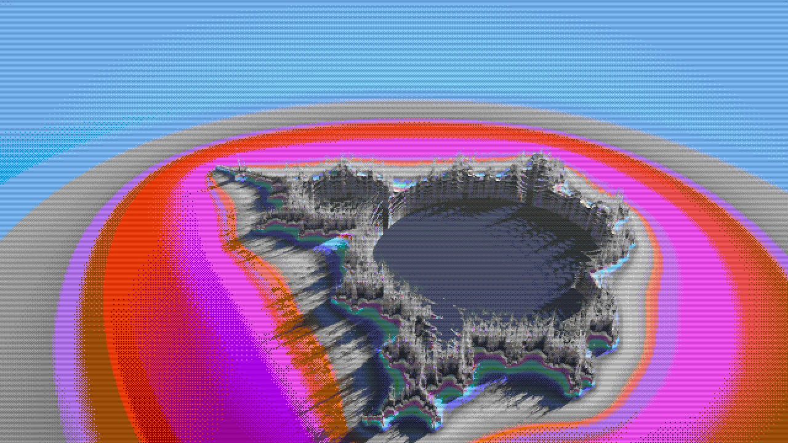

# Fract3D

A GPU fractal explorer for Linux, built as a 3D homage to **Fractint**. You can fly through Mandelbulbs, Mandelboxes and Kleinian caves in real time, or switch to a path tracer and let the image refine to photographic quality. There is also a Classic 2D mode with VGA palettes and color cycling. Every fractal includes a short lesson on the math behind it.

| | | |
|---|---|---|
|  |  |  |
|  |  |  |
|  |  |  |

## Build & run

Needs a C++20 compiler, CMake, GLFW 3, libepoxy and MPFR/GMP, plus an OpenGL 4.6 GPU; ffmpeg is optional (video export). Dear ImGui and stb are vendored in `third_party/` (see its README).

```bash
cmake -S . -B build -G Ninja -DCMAKE_BUILD_TYPE=Release && cmake --build build
./build/fract3d
```

To install for your user, including an app-menu entry:

```bash
cmake --install build --prefix ~/.local
```

## What's inside

**3D fractals** (ray marched with distance estimators, all in `fractals/*.glsl`):
Mandelbulb, Mandelbox, Menger sponge, Sierpinski tetrahedron, Kaleidoscopic IFS, Quaternion Julia (a 3D slice of a 4D object), Apollonian cathedral, Pseudo-Kleinian, and an escape-time landscape that turns any 2D Mandelbrot view into terrain.

**Two renderers.** *Real-time* uses soft shadows, ambient occlusion, fog and glow, and adapts its resolution to hold your target frame rate. *Path traced* adds global illumination, glossy reflections and depth of field. Both keep refining (anti-aliasing and noise) while the camera is still.

**Classic 2D mode.** Mandelbrot, Burning Ship, Tricorn, Multibrot, Newton, Phoenix, Lambda and Magnet I, plus your own formulas:
- the exact VGA power-on palette with Fractint-style integer color bands, or smooth coloring
- free color cycling (only palette indices are stored, just like rotating the VGA DAC)
- seven coloring methods: escape time, binary decomposition, escape angle, stripe average, two orbit traps, biomorphs
- right-click any point for its Julia set, or press J for a live Julia preview under the cursor
- an orbit viewer that draws z0, z1, z2 ... under the cursor
- **deep zoom**: floats, then doubles, then perturbation theory with an arbitrary-precision reference orbit and linear skip-ahead (BLA) and series approximation - zooms to 10^290x, checked pixel by pixel against exact arithmetic; periodicity checking for the inside, and the anti-aliased render reuses the preview
- progressive rendering in resumable chunks (Fractint's scanline reveal), so even millions of iterations never stall the desktop
- **Lift into 3D** turns the current view into a landscape - sharp to about 10^11x, thanks to its own double-precision reference orbit

**Formula files.** Fractint-style `.frm` formulas (`Name { init : loop, test }`, with `|z|`, `if/elseif/else/endif`, `fn1..fn4`, `p1..p5`, `maxit`, `whitesq` and Fractint's function list) are transpiled to GPU code; thirteen classics ship in `formulas/`, and the editor compiles yours with Ctrl+Enter. They work in 2D and as 3D landscapes, and a CPU interpreter of the same language drives the orbit viewer (and checks the GPU in the tests).

**Animation.** Add keyframes (K), and the app flies smoothly between them - camera, lighting, colors and every parameter are interpolated; 2D zooms keep a constant zoom rate. Export to MP4 through ffmpeg (x264 or NVENC), or as numbered lossless PNGs (each frame carries its view).

**Your work is never lost.** Undo/redo with a history of views (Ctrl+Z / Ctrl+Y), the last session reopens at startup, and every screenshot carries its complete view inside the PNG: drop it back on the window to continue from exactly there.

**Learning.** The Learn panel has three tabs:
- **This fractal:** a lesson on the current fractal
- **Concepts:** fractal dimension, escape time, distance estimation, IFS and folding, orbit traps, precision, path tracing, history
- **Tour:** a guided walk through 18 curated views

Every slider has a tooltip explaining what it does.

**Fractint's own files.** Drop a Fractint `.PAR` collection on the window (or `--par file.par --par-entry Name`) and pick a view: the formula, view, iterations, bailout, inside/outside coloring and the encoded palette are carried over, and whatever can't be (rotated views, exotic coloring modes) is listed rather than silently dropped. Fractint `.frm` formula files and `.MAP` palettes load too.

**Nostalgia.** A "Fractint (DOS blue)" UI theme, a retro filter (VGA 256 or EGA 16 colors with ordered dithering, chunky pixels, scanlines), Fractint `.MAP` palette files, a gradient palette editor, and `.par` parameter files.

**Rendering.** Samples come from Owen-scrambled Sobol sequences with a blue-noise shift, so path-traced images converge about twice as fast and look clean early. Shaders compile in parallel in the background, and the app sleeps once an image is finished.

## Controls

| 3D | |
|---|---|
| Left drag | orbit around the target |
| Right drag | look around |
| Middle drag / Shift+left drag | pan |
| Wheel | zoom in smoothly (slows down near surfaces, never goes through them) |
| W A S D, Q/E | fly (speed adapts to the distance to the surface); Shift = 4x |
| Double-click | turn toward the clicked point (it becomes the orbit center) |
| F | focus depth of field at screen center |
| P | toggle path tracing |
| R | reset view |
| 1-9 | switch fractal |
| K | add a camera-path keyframe |

| 2D | |
|---|---|
| Left drag / wheel | pan / zoom at cursor |
| Right-click or Space | Julia set of the point (and back) |
| O | show orbit under cursor |
| J | live Julia preview for the point under the cursor |
| B | Fractint bands vs smooth color |
| + / - | double / halve max iterations |

| Everywhere | |
|---|---|
| Tab | hide/show UI |
| M | switch 3D / Classic 2D |
| C | color cycling |
| N / Shift+N | next / previous tour stop |
| L | Learn panel |
| F1 | help |
| F11 | fullscreen |
| F12 | screenshot to ~/Pictures/fract3d (the view is stored inside the PNG) |
| Ctrl+S | save view as .par |
| Ctrl+Z / Ctrl+Y | undo / redo (Edit menu: history) |
| Drag & drop | a screenshot PNG, .par (Fract3D or Fractint), .frm or .map file onto the window |

A gamepad works too: sticks fly and look, triggers go down/up (F1 lists it all).

## Write your own fractal

Drop a `.glsl` file into `fractals/`. The header comments become the UI:

```glsl
// @name My Fractal
// @category Folding
// @camera 2 1.5 -3   0 0 0            (camera position, then target)
// @render stepFactor=0.9 detail=0.5   (ray marching hints)
// @look palette="Gold" colorScale=1.2 floor=1 floorY=-1.2
// @param float scale = 2 [1, 3] "Scale" -- tooltip text
// @param vec3 offset = (1, 1, 1) [0, 2] "Offset" -- ...
// @param choice fold = 0 {Tetrahedral, Octahedral} "Symmetry" -- ...
// @about
// # A heading
// Lesson text shown in the Learn panel.
// $ formula lines render in monospace
// * bullet points
// @end

float DE(vec3 p, inout vec4 trap) {
    // return a distance estimate; set trap.x/.y (orbit traps) and .z (iterations) for coloring
}
```

Parameter types are `float`, `int`, `bool`, `vec2`, `vec3`, `vec4`, `color` and `choice`. Add `log` after the range for a logarithmic slider, and `hires` to keep a value in double precision in PAR files (the landscape's center uses it). Helpers such as folds, rotations, and complex and quaternion math are in `shaders/common.glsl`. Save the file and the app reloads it instantly; compile errors appear on the Fractal tab. The same goes for editing anything in `shaders/`.

## Command line

```
fract3d [--fractal KEY] [--par FILE|IMAGE.png] [--2d] [--formula NAME] [--pt|--rt] [--theme modern|fractint]
fract3d --par presets/07-mandelbulb-path-traced.par --render out.png --size 3840x2160 --samples 1024
fract3d --path my.f3dpath --render flight.mp4 --size 1920x1080 --fps 30 --samples 64
fract3d --path my.f3dpath --render frames/f-%05d.png          # numbered PNGs instead of a video
fract3d --path my.f3dpath --path-time 2.5 --render still.png  # one moment of a path
fract3d --par collection.par --par-entry Seahorse --render out.png   # a Fractint PAR entry
```

`--render` renders offscreen and exits (images, or videos with `--path`). `--gl-debug` reports OpenGL errors.

## Tests

```bash
ctest --test-dir build                      # ~90 tests, about 10 seconds (needs a GPU and a display)
cmake --build build -t update-golden        # after an intentional visual change
cmake --preset asan && cmake --build --preset asan && ctest --preset asan
```

The suite renders every fractal, preset (against golden images), formula and UI window headlessly; checks
that saved views reproduce their images exactly, that hostile PAR files are repaired, that deep zoom matches
exact arithmetic (`tools/itercheck` recomputes every pixel with MPFR), and (with `--self-test`) undo/redo, camera
paths and exact deep-zoom panning.

## Layout

```
src/        C++: app loop & input, renderer, UI, fractal file parser, PAR files, palettes
shaders/    raymarch.frag (3D), classic2d.comp (2D, resumable + perturbation), display.frag, common.glsl
fractals/   one self-describing .glsl per 3D fractal
formulas/   Fractint-style .frm formula files
presets/    the guided tour (.par)
docs/       concepts.txt and classic.txt (Learn panel content), the two code reviews and their resolutions
tests/      golden images, hostile inputs, test paths and deep views; tools/ imgdiff and itercheck (exact MPFR check)
```

## License

MIT (see `LICENSE`). Dear ImGui and stb are vendored under their own MIT/public-domain licenses in `third_party/`.
